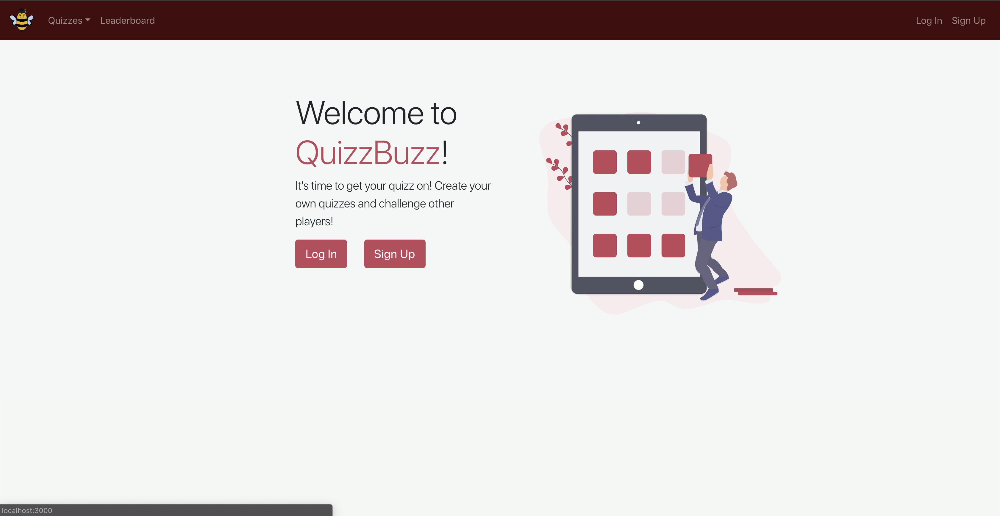
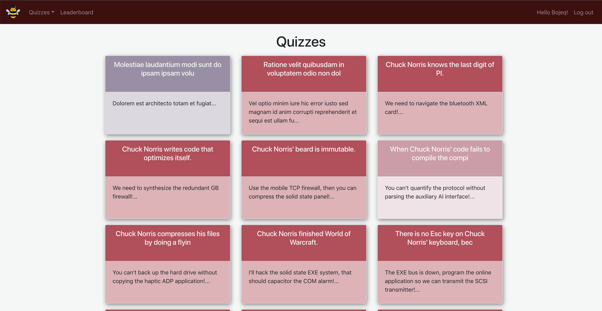
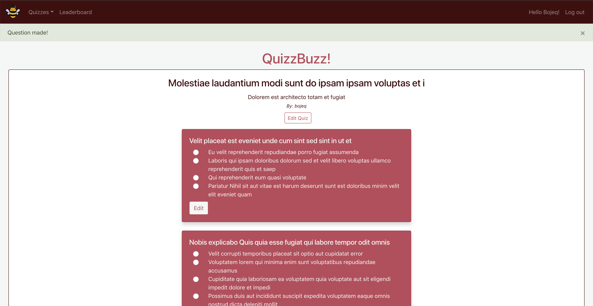
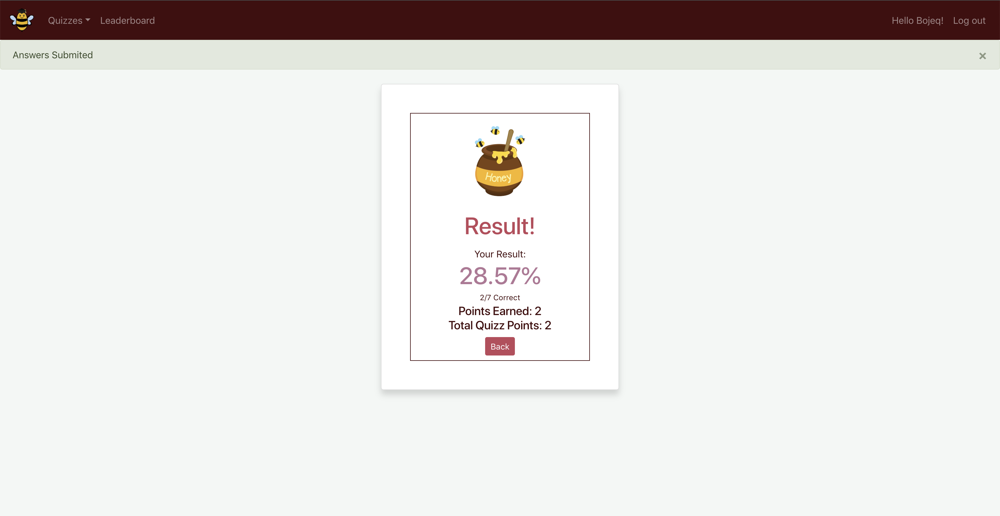

# QuizzBuzz

Team Salmon presents: QuizzBuzz https://quizzbuzzsalmon.herokuapp.com/


## Summary

Our project is a quiz website that will allow users to add and take quizzes that are added onto our site. All of the quizzes are community-generated. 

## Getting Started

Follow these instructions to get a copy of the project up and running on your local machine for development.

## Installation

Make a git clone of the repository, and then bundle:

```bash
bundle
```

Start the server with: 
```bash
rails s
```

Log onto the server at http://localhost:3000.


## Built With

Ruby on Rails 

## Contributors

- [Rosa Diaz](https://github.com/rosadiaz)
- [Daniel Hawkins](https://github.com/dockhands)
- [Nicholas Chan](https://github.com/LeoBotti)
- [Ronald Liu](https://github.com/rkkl1337)
- [Orsolya Torokne Bus](https://github.com/orsolyabus)
- [Chris Chu](https://github.com/chrischu5)

## Screenshots









## Acknowledgments

Shout out to FizzBuzz

